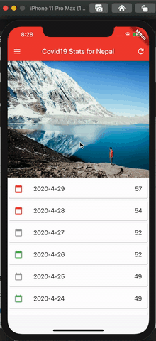

# Covid19 flutter app

A covid19 Flutter project. This app was build for learning basics of flutter. This things included in this project are:

- Create and run a basic flutter project
- Write a hello world 
- Build stateful and stateless widget
- Layouts
- Create a list
- Navigation on touch
- Drawers

## Getting Started

This project is a starting point for a Flutter application.

A few resources to get you started if this is your first Flutter project:

- [Lab: Write your first Flutter app](https://flutter.dev/docs/get-started/codelab)
- [Cookbook: Useful Flutter samples](https://flutter.dev/docs/cookbook)

For help getting started with Flutter, view our
[online documentation](https://flutter.dev/docs), which offers tutorials,
samples, guidance on mobile development, and a full API reference.

Editor used: Visual Studio Code

## ScreenShot

